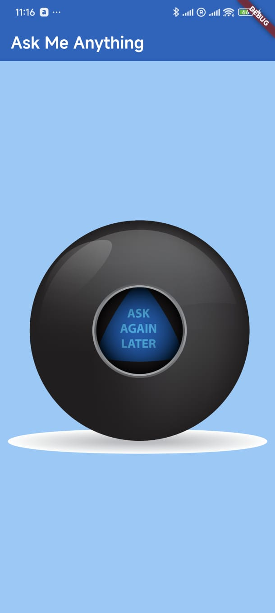

# 🔮 Ask Me Anything - Magic 8 Ball App

A fun and interactive Flutter app that simulates a **Magic 8 Ball**. Tap the ball to reveal a random answer to your yes-or-no question.

<p align="center">
  
</p>

## ✨ Features

- Random answer generation on tap  
- Simple, clean, and colorful UI  
- Great for decision-making fun  
- Powered by Flutter's stateful widget system  

## 🛠️ Built With

- [Flutter](https://flutter.dev/)  
- Dart  
- Stateful widgets  
- `Random` class from Dart core library  
- `Image.asset` for dynamic image switching  

## 📂 Project Structure

```
lib/
├── main.dart         # App logic and UI
images/
├── ball1.png
├── ball2.png
├── ball3.png
├── ball4.png
└── ball5.png
```

> ⚠️ Make sure to include the `images/` directory with all five Magic Ball images in your project.

## 📦 Asset Setup

Include your image assets in the `pubspec.yaml`:

```yaml
flutter:
  assets:
    - images/
```

## 💡 How It Works

- When the user taps on the ball, a random number from 1 to 5 is generated.  
- Based on the number, a corresponding image (`ball1.png` to `ball5.png`) is displayed.  
- The UI updates in real-time using `setState()`.

## 🏁 Getting Started

1. **Clone the repo**  
   ```bash
   git clone https://github.com/aarogyaojha/magic_8_ball.git
   cd magic-ball-flutter
   ```

2. **Get dependencies**  
   ```bash
   flutter pub get
   ```

3. **Run the app**  
   ```bash
   flutter run
   ```

## 🙌 Inspiration

Inspired by the Magic 8 Ball toy and built as a beginner-friendly Flutter project.

## 📄 License

This project is licensed under the [MIT License](LICENSE).
